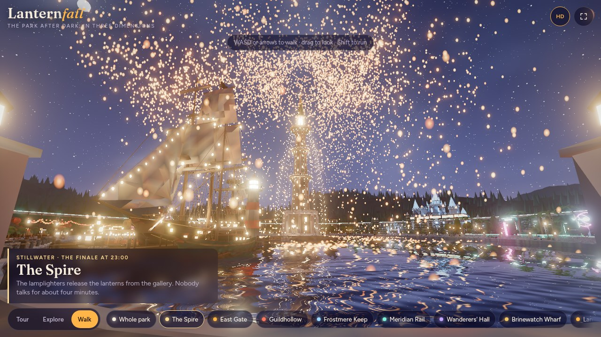

# Lanternfall 3D

A fictional night-time theme park you can fly over, orbit and walk through in the browser.

**Live:** https://sh1ftmaker.github.io/lanternfall-3d/


Seven lands ring a still, black lake. A needle tower stands on an island in the middle, a monorail loops over
every land, and at eleven ten thousand paper lanterns come down onto the water.

| | |
|---|---|
|  |  |

## Controls

| Mode | What it does | Desktop | Touch |
|---|---|---|---|
| **Tour** | A looping guided flight over the gate, the Spire, each land and the monorail | Drag to take over | Drag to take over |
| **Explore** | Free orbit, with chips to fly to any land | Drag, scroll, right-drag | Drag, pinch, two-finger pan |
| **Walk** | First person on the ground, with collisions | WASD or arrows, drag to look, Shift to run | Left thumb walks, right thumb looks |

The **HD** button toggles water reflections and glow. The page also lowers quality by itself if frames run slow.

## What moves

- The lantern fall is a living cycle: lanterns are released from the Spire, rise, hang over the lake, settle on the
  water and burn out.
- The lake has interactive ripples (tap or click the water), rings from the floating lanterns, and a lamp-lit punt
  circling the island.
- The carousel in Rosewick turns, the monorail runs, it snows in Frostmere, there are fireflies and petals in the
  gardens, steam and smoke at the stalls, and fireworks during the tour's Spire shot and finale.

## Optional switches

Add these after `#` in the address, separated by commas, then reload.

| Token | Effect |
|---|---|
| `fx=hd` | New post chain: ambient occlusion, mip bloom, SMAA |
| `fx=ultra` | The above plus temporal anti-aliasing, tilt-shift on aerial tour shots and light streaks |
| `nodetail` | Turn off the procedural paving, plank, masonry and roof detail |
| `noshadow` | Turn off moon shadows |
| `oldwater` | The previous lake water, for comparison |
| `aurora` | Aurora in the night sky |
| `no-motes`, `no-fireworks`, `no-beams`, `no-mist`, `no-carousel` | Turn individual effects off |

## How it is built

- The park was modelled procedurally in Blender (Python scripts, headless) and lit in Cycles.
- Lantern, lamp and window light is baked into vertex colours, so the page needs no real-time lights for them.
  Moonlight is the one live light: it is added per pixel with a shadow map rendered once from the moon.
- Surfaces get crisp detail from a small procedural shader (`fx/surface.js`): each vertex carries a surface class
  (paving, wood, masonry, roof, organic) that selects setts, planks, block courses or tile rows.
- Geometry is quantised, delta-filtered and gzip-compressed into `data/*.bin` (about 33 MB in total).
  The browser unpacks it with `DecompressionStream`; there is no WebAssembly and no build step.
- Rendering uses [three.js](https://threejs.org/) from a CDN. The viewer is `app.js` plus small modules in `fx/`:
  lake water with a planar mirror and a ripple simulation, the lantern fall, particles, depth-precision handling,
  and the optional post chain.
- Walk mode uses a precomputed 0.5 m navigation grid (`data/nav.bin`) instead of mesh collision.

## Run locally

Any static file server works:

```bash
python3 -m http.server 8765
```

Then open http://localhost:8765/.

## Notes

Lanternfall is a fictional park. This repository contains only the 3D park model and the viewer.
