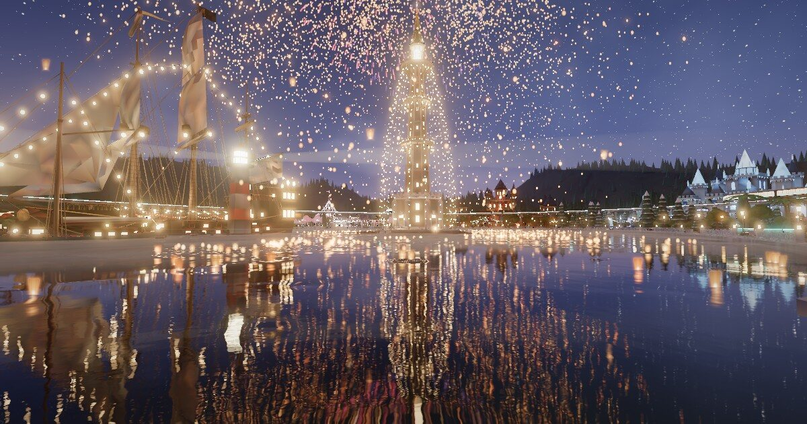
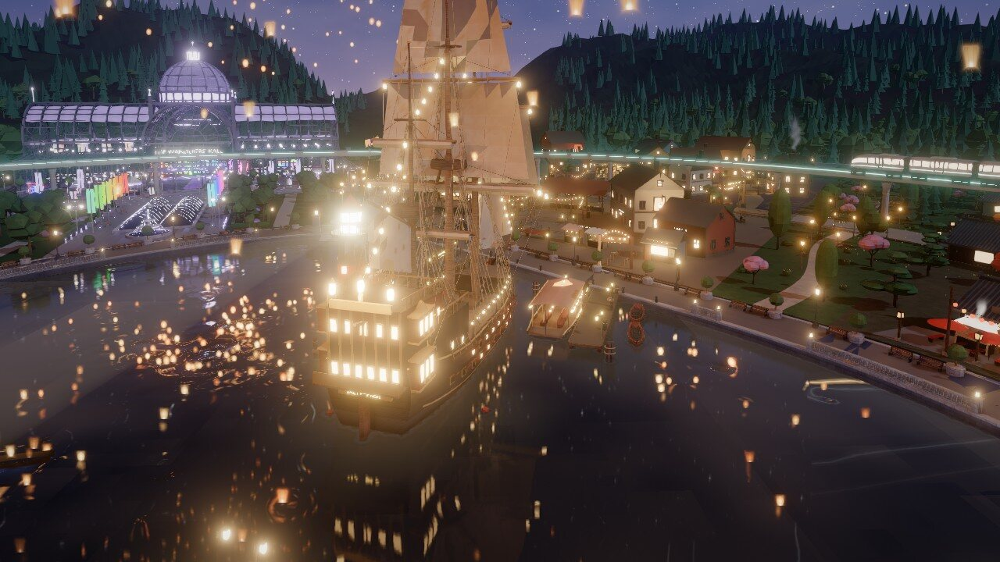
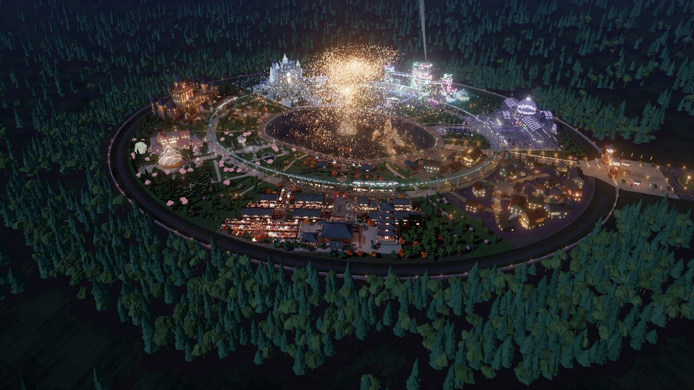

# Lanternfall 3D

A fictional night-time theme park you can fly over, orbit and walk through in the browser.

**Live:** https://sh1ftmaker.github.io/lanternfall-3d/



Seven lands ring a still, black lake. A needle tower stands on an island in the middle, a monorail loops over
every land, and at eleven ten thousand paper lanterns come down onto the water.

| | |
|---|---|
|  |  |

## Controls

| Mode | What it does | Mouse and keyboard | Touch |
|---|---|---|---|
| **Tour** (`1`) | A 2½-minute guided flight over the gate, the Spire, each land and the monorail, on a loop | Drag to take over | Drag to take over |
| **Explore** (`2`) | Free orbit; the place chips fly you to each land | Drag, scroll, right-drag; arrows or WASD, `+`/`-`, Shift+arrows to pan | Drag, pinch, two-finger pan |
| **Walk** (`3`) | First person on the ground; the chips drop you at each land | WASD or arrows, drag to look, Shift to run, `Esc` to leave | Left thumb walks, right thumb looks |

`F` toggles full screen. The settings button (top right) has the picture quality (**Fast**, **HD**, **Cinematic**),
switches for fireworks, lake mist and searchlights, and **Reduce motion** (also taken from the system setting).
Choices are remembered in the browser. The page also lowers quality by itself if frames run slow.

## What moves

- The lantern fall is a living cycle: lanterns are released from the Spire, rise, hang over the lake, settle on the
  water and burn out.
- The lake has interactive ripples (tap or click the water), rings from the floating lanterns, and a lamp-lit punt
  circling the island.
- The carousel in Rosewick turns, the monorail runs, it snows in Frostmere, there are fireflies and petals in the
  gardens, steam and smoke at the stalls, and fireworks during the tour's Spire shot and finale.

## Optional switches

Add these after `#` in the address, separated by commas, then reload.

| Token | Effect |
|---|---|
| `fx=hd` | The Cinematic post chain: ambient occlusion, mip bloom, SMAA (same as the setting) |
| `fx=ultra` | The above plus temporal anti-aliasing, tilt-shift on aerial tour shots and light streaks |
| `fx=legacy` | The HD chain (bloom), whatever the saved setting |
| `aurora` | Aurora in the night sky |
| `no-motes`, `no-fireworks`, `no-beams`, `no-mist`, `no-carousel` | Turn individual effects off |
| `nosim`, `noboat` | No ripple simulation on the lake, no punt |

## How it is built

- The park was modelled procedurally in Blender (Python scripts, headless) and lit in Cycles.
- Lighting, colour and emission are baked into vertex colours, so the page needs no real-time lights.
- Geometry is quantised, delta-filtered and gzip-compressed into `data/*.bin` (about 34 MB in total).
  The browser unpacks it with `DecompressionStream`; there is no WebAssembly and no build step.
- Rendering uses [three.js](https://threejs.org/) from a CDN. The viewer is `app.js` plus small modules in `fx/`:
  the lake (planar mirror and ripple simulation), the lantern fall, particles, depth-precision handling, the post
  chain, the settings sheet and WebGL context-loss recovery.
- Walk mode uses a precomputed 0.5 m navigation grid (`data/nav.bin`) instead of mesh collision.
- Needs WebGL 2 (any current desktop or phone browser).

## Run locally

Any static file server works:

```bash
python3 -m http.server 8765
```

Then open http://localhost:8765/.

## Notes

Lanternfall is a fictional park. This repository contains only the 3D park model and the viewer.
